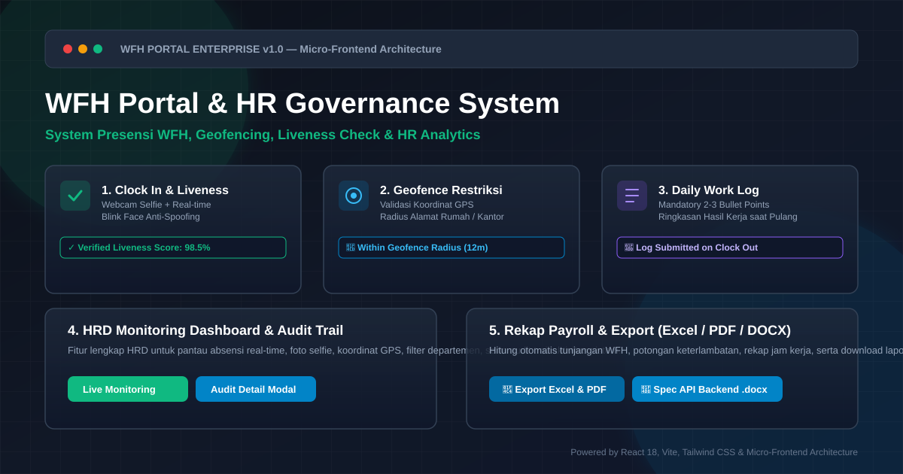
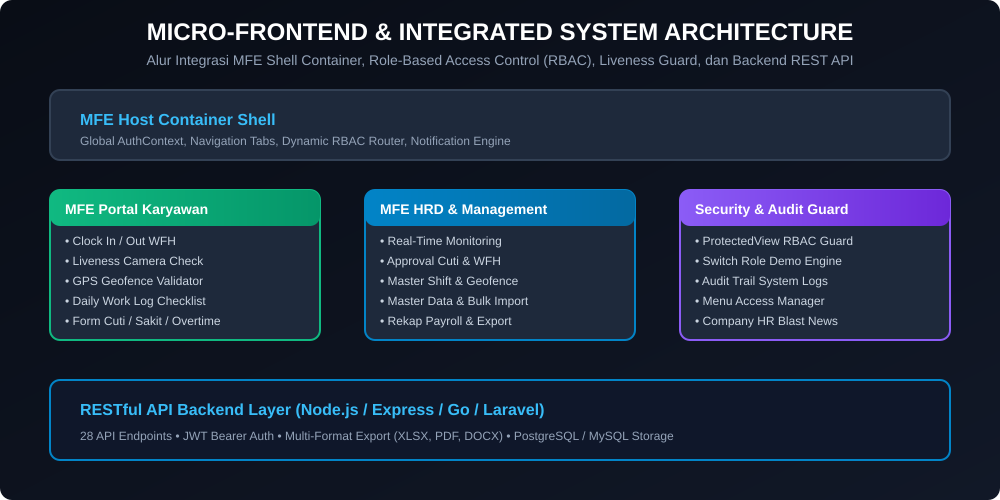

# 🏢 WFH Portal & HR Governance Enterprise System

> **Sistem Absensi, Geofencing, Liveness Detection, Work Log & HR Analytics Terintegrasi**  
> Ditujukan untuk meningkatkan efisiensi, transparansi, dan integritas kerja WFH (Work From Home) serta WFO (Work From Office) tanpa perlu micromanagement.

---

## 📸 Preview Aplikasi & Banner Utama



---

## 🌟 Fitur Utama Sistem

Sistem ini dirancang untuk memenuhi **11 Modul Kunci HR Governance & WFH Management**:

### 1. 📋 Daily Work Log & Summary Task (Laporan Kegiatan Harian)
- Wajib mengisi 2–3 poin ringkasan hasil kerja hari itu saat tombol **Clock Out (Pulang)** ditekan.
- Admin HRD & Manager dapat langsung melihat log pekerjaan tersambung dengan foto selfie dan lokasi GPS hari tersebut.

### 2. 📝 Alur Pengajuan Izin / Cuti / Sakit & Lembur (Leave & Permit Workflow)
- Formulir pengajuan Cuti Tahunan, Sakit (dengan unggah Lampiran Surat Dokter), Izin Khusus, dan Ekstra WFH.
- Status absensi otomatis berubah menjadi **Sakit / Izin / Cuti** setelah disetujui (*Approved*) oleh Admin HRD.

### 3. 🚨 Geofencing Radius Restriction (Validasi Lokasi Rumah / Co-Working)
- Pengecekan koordinat GPS secara akurat dari lokasi rumah karyawan atau kantor resmi (*Authorized Office*).
- Jika posisi GPS berada di luar radius izin (contoh: > 100m), sistem memberikan peringatan (*Warning / Requires Note*).

### 4. 📊 HR Analytics Dashboard & Auto-Export Payroll
- Grafik visualisasi tingkat kehadiran bulanan, tren keterlambatan, dan distribusi lokasi (WFH vs WFO).
- **Export Report**: Fitur unduh rekap data dalam format **Excel (.xlsx)**, **PDF**, serta **Spesifikasi API Backend (.docx)**.

### 5. 🔔 Pengingat Absensi Otomatis & Notifikasi
- Indikator status Overtime/Lembur jika karyawan masih Clock In melewati jam operasional.
- Widget pengingat visual jadwal jam masuk (08:00) dan jam pulang (17:00).

### 6. 🛡️ Liveness Detection & Anti-Fake GPS Guard
- **Liveness Check**: Deteksi kedipan mata / gerakan wajah sederhana saat webcam menangkap foto selfie untuk mencegah foto dari layar HP lain.
- **Fake GPS Guard**: Deteksi skor akurasi lokasi perangkat untuk mencegah manipulasi GPS spoofing.

### 7. 🏛️ Master Data Shift Kerja & Deteksi Keterlambatan
- Pengaturan jam operasional (contoh: Shift Pagi 08:00–17:00, Flexi-Hours).
- Deteksi status presensi otomatis: *Tepat Waktu*, *Terlambat (Late)*, *Pulang Lebih Awal (Early Departure)*, dan *Lembur (Overtime)*.

### 8. 💰 Kalkulasi Tunjangan Kehadiran & Rekap Payroll
- Hitung otomatis total hari WFH vs WFO, total jam kerja, tunjangan kehadiran WFH, serta potongan keterlambatan.

### 9. 📢 Company Announcements & HR Blast
- Banner pengumuman kebijakan WFH terbaru / libur nasional di halaman utama dengan status *Dibaca / Belum Dibaca*.

---

## 🏗️ Arsitektur Aplikasi (Micro-Frontend & Security)



Aplikasi dibangun menggunakan arsitektur **Micro-Frontend (MFE)** yang modular:
1. **MFE Host Container Shell**: Mengatur autentikasi global, tab navigasi, role switcher, dan notification engine.
2. **MFE Employee Portal**: Menangani fitur operasional karyawan (Clock In/Out, Liveness, Geofence, Work Log, Cuti).
3. **MFE HRD Governance**: Menangani fitur manajemen HRD (Monitoring Real-time, Approval Cuti, Master Data, Shift & Geofence Config, Audit Logs, Payroll Recap).
4. **ProtectedView Security Guard**: Melindungi visual dan aksi berdasarkan role izin RBAC (*Role-Based Access Control*).

---

## 📂 Dokumentasi Spesifikasi API Backend (.docx)

Sistem telah dilengkapi dengan dokumen spesifikasi teknis REST API backend lengkap versi **Microsoft Word (.docx)** yang dapat diunduh langsung melalui aplikasi.

- **Lokasi Berkas**: `/public/Dokumentasi_API_WFH_Portal.docx`
- **Cara Download di UI**:
  1. Buka aplikasi di browser.
  2. Klik tombol **`DOCX API`** pada bagian Navbar atas, atau tombol **`Download Spec API (.docx)`** pada footer paling bawah.
- **Cakupan API**: Berisi rincian 28 Endpoint API RESTful, format Request JSON, Response JSON, Query Parameter, dan Header.

---

## 🚀 Panduan Jalankan Aplikasi (Local Development)

### Prasyarat
- **Node.js**: v18.x atau lebih baru
- **npm**: v9.x atau lebih baru

### Langkah-Langkah Running:

1. **Clone repository & masuk ke direktori**:
   ```bash
   cd applet
   ```

2. **Install seluruh dependencies**:
   ```bash
   npm install
   ```

3. **Jalankan Development Server**:
   ```bash
   npm run dev
   ```
   Aplikasi akan berjalan pada port `http://localhost:3000`.

4. **Build untuk Production**:
   ```bash
   npm run build
   ```

---

## 🐳 Panduan Deploy Menggunakan Docker & Docker Compose

Sistem ini mendukung containerization menggunakan **Docker** (Multi-stage build dengan Nginx High Performance) untuk kemudahan deployment di Cloud Run, VPS, Kubernetes, maupun lingkungan Docker lokal.

### 1. Menjalankan via Docker Compose (Rekomendasi)

Jalankan perintah berikut pada terminal di folder utama proyek:

```bash
# Jalankan container di background
docker compose up -d --build
```

Setelah proses build selesai, buka browser di:
`http://localhost:3000`

Untuk menghentikan container:
```bash
docker compose down
```

---

### 2. Menjalankan via Docker CLI Manual

#### Step A: Build Docker Image
```bash
docker build -t wfh-portal-app .
```

#### Step B: Jalankan Container
```bash
docker run -d \
  --name wfh_portal_container \
  -p 3000:3000 \
  --restart unless-stopped \
  wfh-portal-app
```

#### Step C: Cek Status & Log Container
```bash
# Cek status container running
docker ps

# Cek log aplikasi
docker logs -f wfh_portal_container
```

---

## 🛠️ Stack Teknologi

- **Frontend**: React 18, TypeScript, Vite
- **Styling**: Tailwind CSS, Lucide React Icons
- **Document Generator**: `docx` library (Automated .docx Spec Builder)
- **Architecture**: Micro-Frontend (MFE) pattern with React Context & RBAC Guard
